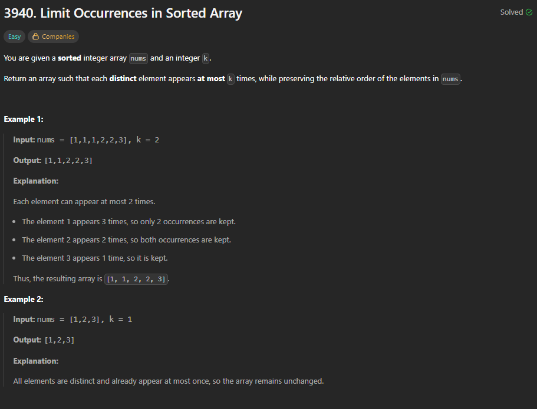

# 3940. Limit Occurrences in Sorted Array



## Problem Description
You are given a **sorted** integer array `nums` and an integer `k`.

Return an array such that each **distinct** element appears **at most** `k` times, while preserving the relative order of the elements in `nums`.

### Example 1
- **Input:** `nums = [1,1,1,2,2,3]`, `k = 2`
- **Output:** `[1,1,2,2,3]`
- **Explanation:**
  Each element can appear at most 2 times.
  - The element `1` appears 3 times, so only 2 occurrences are kept.
  - The element `2` appears 2 times, so both occurrences are kept.
  - The element `3` appears 1 time, so it is kept.
  Thus, the resulting array is `[1, 1, 2, 2, 3]`.

### Example 2
- **Input:** `nums = [1,2,3]`, `k = 1`
- **Output:** `[1,2,3]`
- **Explanation:**
  All elements are distinct and already appear at most once, so the array remains unchanged.

---

## Approach 1: Auxiliary Space (Keeping Counts)

### Intuition
Since the input array is already **sorted**, all identical elements are grouped together consecutively. We can traverse the array and maintain a counter to keep track of the frequency of the current element. If the frequency is less than or equal to `k`, we keep the element.

### Implementation
```python
class Solution:
    def limitOccurrences(self, nums: list[int], k: int) -> list[int]:
        stor_arr=[]
        count=0
        for i in range(len(nums)):
            if i==0 or nums[i]!=nums[i-1]:
                count=1
            else:
                count+=1
                
            if(count<=k):
                stor_arr.append(nums[i])

        nums[:]=stor_arr  
        return nums 
```

### Complexity Analysis
- **Time Complexity:** $\mathcal{O}(N)$ where $N$ is the number of elements in the array `nums`. We do a single pass over the array.
- **Space Complexity:** $\mathcal{O}(N)$ auxiliary space to store the selected elements in `stor_arr` before updating `nums` in-place.

---

## Approach 2: Two-Pointer (In-Place / Optimal Space)

### Intuition
We can optimize the space complexity to $\mathcal{O}(1)$ auxiliary space by modifying the array in-place using a two-pointer technique.
- A `write_idx` pointer tracks where the next valid element should be placed.
- Since the array is sorted, the element at index `i` is valid to be written if it has appeared at most `k` times. This can be verified by comparing `nums[i]` with the element written `k` positions back (i.e., `nums[write_idx - k]`).

### Implementation
```python
class Solution:
    def limitOccurrences(self, nums: list[int], k: int) -> list[int]:
        write_idx = 0
        for x in nums:
            # We always keep the first k elements, or any element that is different 
            # from the element written k positions before.
            if write_idx < k or x != nums[write_idx - k]:
                nums[write_idx] = x
                write_idx += 1
                
        # Truncate the list to write_idx elements in-place
        nums[:] = nums[:write_idx]
        return nums
```

### Complexity Analysis
- **Time Complexity:** $\mathcal{O}(N)$ where $N$ is the number of elements in `nums`. We traverse the array exactly once.
- **Space Complexity:** $\mathcal{O}(1)$ auxiliary space since we modify the array completely in-place.
