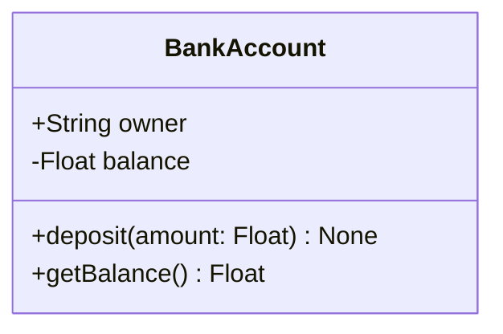
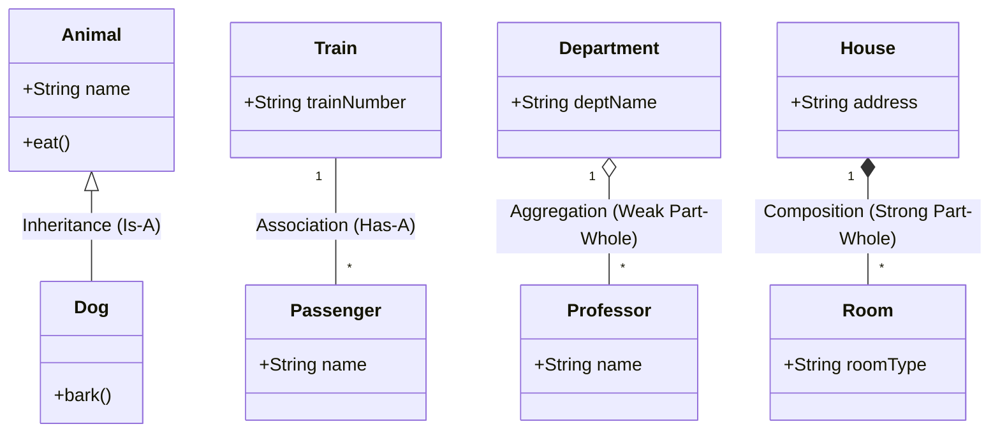

# Class Diagram

A **Class Diagram** is a type of structural blueprint used in Object-Oriented Programming (OOP) to visually map out a system's structure. It acts like an architectural drawing for your code.

Instead of showing how objects interact over time, a Class Diagram shows the **static structure** of the system: what classes exist, what data and behaviors they contain, and how they relate to one another.

---

## 🏗️ The Anatomy of a Class in a Diagram

In a Class Diagram, every class is represented by a simple rectangle split into three distinct horizontal compartments:



1. **Top Compartment (Class Name):** The name of the data type (e.g., `Vehicle`, `BankAccount`, `Node`).
2. **Middle Compartment (Attributes / Variables):** The state or data fields the class holds, along with their data types.
3. **Bottom Compartment (Operations / Methods):** The functions or behaviors the class can perform, including their parameters and return types.

---

## 🔒 Access Modifiers (Visibility)

To show encapsulation, Class Diagrams use simple shorthand symbols next to attributes and methods to indicate who can look at or modify them:

* **`+` Public:** Accessible from anywhere outside the class.
* **`-` Private:** Accessible only within this specific class (highly common for raw attributes).
* **`#` Protected:** Accessible within this class and its child/inherited subclasses.

---

## 🔗 Relationships Between Classes

A system rarely consists of just one isolated class. Class Diagrams use different styled lines and arrows to show exactly how your custom data types connect with each other. Here is a visual overview of the most common relationships:



### 1. Inheritance / Generalization (Is-A Relationship)
Shows that a child class inherits everything from a parent class.
* **Arrow:** A solid line with a hollow, white triangle pointing to the parent class (`<|--`).
* **Example:** A `Dog` class inherits from an `Animal` class.

### 2. Association (Has-A Relationship)
A basic connection where one class uses or holds a reference to another class.
* **Arrow:** A simple solid line connecting the two classes (`--`).
* **Example:** A `Passenger` rides a `Train`.

### 3. Aggregation vs. Composition (Part-Whole Relationships)
* **Aggregation (Weak Relationship):** The "part" can exist independently of the "whole". Represented by a hollow diamond (`o--`).
  * *Example:* A `Department` has `Professors`. If the department closes, the professors still exist.
* **Composition (Strong Relationship):** The "part" cannot exist without the "whole". Represented by a solid, filled-in black diamond (`*--`).
  * *Example:* A `House` has `Rooms`. If you destroy the house, the rooms are destroyed instantly.

---

## 💻 From Diagram to Code: A Practical Example

Imagine we draw a quick Class Diagram for a simple banking feature. Here is how that visual blueprint translates directly into actual Python code:

```python
class BankAccount:
    def __init__(self, owner: str, balance: float):
        self._owner = owner          # Protected attribute (#owner: String)
        self.__balance = balance     # Private attribute (-balance: Float)

    def deposit(self, amount: float) -> None:  # Public method (+deposit)
        self.__balance += amount

    def get_balance(self) -> float:            # Public method (+getBalance)
        return self.__balance
```

---

## 🎯 Why Software Engineers Use Them

* **Forward Design:** It is much easier to sketch out boxes and lines on a whiteboard to organize a massive code architecture before spending weeks typing thousands of lines of code.
* **Reverse Engineering:** You can use tools to automatically scan a messy, sprawling codebase and generate a class diagram to instantly see how all the components are coupled.
* **System Design Interviews:** For senior roles, you are often asked to sketch these out to prove you can map real-world requirements (like "Design an Elevator System" or "Design Parking Lot") into distinct, clean object models.
